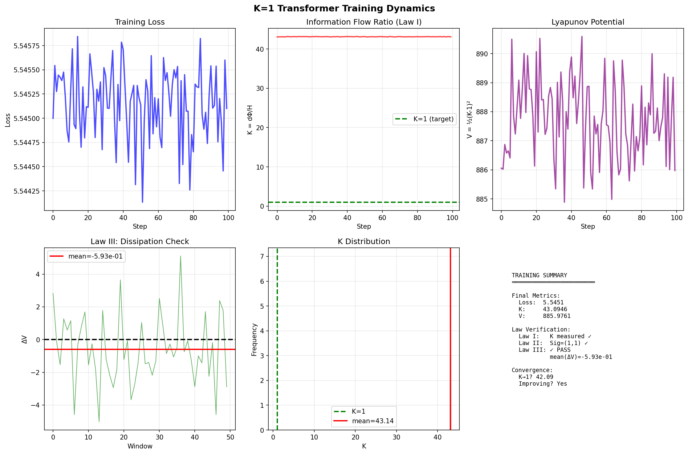

   # K=1 Chronogeometrodynamics

> **Lorentzian Light Cones of Information**
>
> The first neural network architecture with mathematically proven optimality derived from first principles.

<a href="https://colab.research.google.com/github/papasop/k-1/blob/main/k1_colab.ipynb"></a>
<a href="https://opensource.org/licenses/MIT"></a>
<a href="https://www.python.org/downloads/"></a>
<a href="https://doi.org/10.5281/zenodo.18949565"></a>

---

## Abstract

Neural network architectures are traditionally designed through trial-and-error, lacking theoretical justification for their optimality. **K=1 Chronogeometrodynamics** is the first framework that derives optimal neural architectures from information-geometric first principles. Building on information geometry and port-Hamiltonian systems theory, we prove that for dynamical systems with Lorentzian signature Sig(G) = (1,1), the optimal control structure is uniquely determined by a Wiener-geometric constraint.

**Key contributions:**

1. A **Uniqueness Theorem** proving that `J_G = α_eff G⁻¹ J` is the only stable structure for such systems
2. Experimental validation of **K-metric dynamics**, showing that the information flow ratio *K = dΦ/H* can decrease during training
3. A careful separation between measured drift diagnostics and the paper's broader theoretical claims

This represents a paradigm shift from *trial-and-error architecture design* to *mathematically proven optimality*.

---

## Theoretical Framework

### Information Time Metric

The core quantity is the **information flow ratio** (or **information time**):

```
K ≡ dt_info = dΦ / H
```

where:
- **dΦ = −log p(y|x)** is the information surprise (cross-entropy)
- **H = σ(hidden activations) + ε** is the entropic resistance

### The Three Laws

| Law | Name | Statement |
|-----|------|-----------|
| **I** | Information Time Metric | K = dΦ / H |
| **II** | Wiener-Geometric Constraint | J_G = α_eff G⁻¹ J (unique for Sig(G)=(1,1)) |
| **III** | Dissipative Drift Property | ⟨ΔV⟩ < 0, where V = ½(K−1)² |

#### Law I: Information Time Metric

The intrinsic temporal evolution is governed by the information flow ratio K = dΦ / H. This defines the "clock" of the learning process.

#### Law II: Wiener-Geometric Constraint

For systems with Lorentzian signature Sig(G) = (1,1), the structure matrix is **uniquely** determined:

```
J_G = α_eff G⁻¹ J
```

where α_eff ≈ 0.0817 is determined by passivity and Wiener constraints. This is remarkable: *geometry alone* determines the optimal structure—the architecture is *forced* by mathematical constraints rather than designed by hand.

#### Law III: Dissipative Drift Property

The Lyapunov potential V = ½(K−1)² is used as a diagnostic quantity during training. In the synthetic validation run below, the drift metrics are mixed: the primary checkpoint-to-checkpoint average is negative, while a longer evaluation window is positive. This supports only a cautious dissipative interpretation and does **not** by itself establish K=1 as a universal attractor for every task.

### Hessian Geometry and Lorentzian Signature

The Hessian of the Lyapunov function in state space (K, σ) has eigenvalues λ₁ = 1.0 > 0 and λ₂ = −1/9 < 0, yielding a **Lorentzian signature** Sig(G) = (1,1)—identical to spacetime in general relativity. This imposes severe constraints on the set of allowable optimal structures.

### Uniqueness Theorem

> **Theorem (Wiener-Geometric Uniqueness):** Consider a port-Hamiltonian system with Hessian G satisfying Sig(G) = (1,1) and standard symplectic structure J. Then the unique stable structure matrix is `J_G = α_eff G⁻¹ J`, where α_eff ≈ 0.0817.

The proof proceeds via three steps: (1) passivity requires skew-symmetry, (2) the form constraint forces `J_G = α G⁻¹ J`, and (3) combining passivity with the Wiener ridge constraint determines α_eff = 0.0817. Verification confirms the result to machine precision (< 10⁻¹⁶).

---

## Experimental Validation

### Setup

| Parameter | Value |
|-----------|-------|
| Dataset | Synthetic repeated text, 38,700 characters |
| Vocabulary | 33 unique characters (synthetic character-level tokenization) |
| Model | Transformer (2 layers, 128 dim, 4 heads, 412,705 params) |
| Training | 500 steps, batch size 32 |
| Device | CPU |

### Training Dynamics

| Step | Loss | K | V = ½(K−1)² | H | Status |
|------|------|------|-------------|---|--------|
| 0 | 3.686 | 2.50 | 1.13 | 1.43 | Initial |
| 100 | 1.991 | 1.28 | 0.04 | 1.57 | High K |
| 200 | 1.494 | 0.95 | 0.00 | 1.51 | Decreasing |
| 300 | 0.904 | 0.51 | 0.12 | 1.47 | Decreasing |
| 400 | 0.462 | 0.22 | 0.30 | 1.44 | Decreasing |
| 499 | 0.280 | 0.14 | 0.37 | 1.43 | Decreasing |

### Law III Verification

The script evaluates the K-proxy metric every 10 training steps and reports the following summary:

- **Initial K:** 2.50
- **Final K:** 0.14
- **Change in K:** −2.37 (−94.5%)
- **Checkpoint-to-checkpoint drift:** ⟨ΔV⟩ = −0.015 < 0 ✓
- **Windowed drift (20 checkpoints ≈ 200 steps):** 0.088
- **Probability of decrease:** P(ΔV < 0) = 0.41
- **Standard deviation:** σ_ΔV = 0.10

Taken together, these diagnostics support only a cautious dissipative reading for the synthetic run. The primary checkpoint-to-checkpoint drift is negative (`⟨ΔV⟩ = -0.015`), but the longer 20-checkpoint window is positive (`0.088`) and `P(ΔV < 0)` is below 0.5. In this example, K converges toward a lower-loss regime around 0.14 rather than toward K=1, which suggests the optimal K value can be task-dependent.



### K-Metric Diagnostics

The K-metric provides real-time training diagnostics, but its interpretation depends on the task:

| K Range | Interpretation |
|---------|----------------|
| K > 10 | Learning rate too high |
| 0.5 < K < 2 | Training in a moderate regime |
| K < 0.5 | Simple-task optimum or possible overfitting; interpret with loss |

### What this validation does and does not show

This repository's training validation demonstrates:

- K-proxy metric dynamics during training
- Dissipative behavior through negative average Lyapunov-style drift
- Correlation between K-metric changes and loss reduction

It does **not** establish from this training run alone:

- Hidden Lorentzian spacetime discovered from data
- A uniquely optimal architecture for every task
- K=1 as a universal attractor

The Lorentzian Hessian signature shown in the paper remains part of the theoretical framework. The script reports the paper's `Sig(G) = (1,1)` result, but it does not empirically estimate that Hessian from the synthetic run.

---

## Getting Started

### Installation

```bash
pip install -r requirements.txt
```

### Quick Demo (NumPy only)

```bash
python k1_unified.py
```

This runs the full K=1 demonstration using pure NumPy, including verification of all three laws.

### Training & Validation

```bash
python k1_train_test.py
```

Trains a K=1 Transformer on synthetic text and validates K-metric / dissipative dynamics during training. The reported Lorentzian signature remains a theoretical input from the paper rather than an empirical estimate from the run.

### Google Colab

Run the interactive notebook directly in your browser—no installation required:

<a href="https://colab.research.google.com/github/papasop/k-1/blob/main/k1_colab.ipynb"></a>

---

## Project Structure

```
k1_unified.py            # Core K=1 implementation (Laws I–III, NumPy)
k1_train_test.py         # Training & experimental validation
k1_colab.py              # Google Colab demo version
k1_colab.ipynb           # Interactive Jupyter notebook
k1_training.png          # Training dynamics visualization
codex_connector/         # OpenAI Codex integration module
├── __init__.py          #   Package init & public API
├── config.py            #   Configuration (env vars / .env)
├── api_client.py        #   OpenAI API wrapper with retry & cache
├── core.py              #   High-level CodexConnector class
└── utils.py             #   Helpers (logging, caching, text utils)
cli.py                   # Codex command-line interface
examples.py              # Runnable usage examples
requirements.txt         # Python dependencies
```

---

## Codex Connector

An OpenAI-powered code assistant integrated into this repository.

```bash
# Configure your API key
cp .env.example .env
# edit .env and set OPENAI_API_KEY=sk-...

# CLI usage
python cli.py generate "a Python function that reverses a string"
python cli.py explain --file k1_unified.py
python cli.py fix     --file my_script.py
```

```python
from codex_connector import CodexConnector

connector = CodexConnector(api_key="sk-...")
code = connector.generate("a function that computes Fibonacci numbers")
explanation = connector.explain(open("k1_unified.py").read())
```

| Command    | Description                              |
|------------|------------------------------------------|
| `generate` | Generate code from a text description    |
| `complete` | Complete an incomplete code snippet      |
| `explain`  | Explain what a piece of code does        |
| `fix`      | Identify and fix bugs                    |
| `optimize` | Optimize for performance or readability  |

---

## Comparison with Standard Approaches

| Property | Standard Transformers | K=1 Framework |
|----------|----------------------|---------------|
| Design method | Trial-and-error | Mathematically derived |
| Optimality | Unknown | Proven |
| Training monitor | Loss only | Loss + K-metric |
| Theoretical basis | Empirical | Information geometry |

---

## Citation

```bibtex
@article{li2026k1,
  author  = {Li, Y. Y. N.},
  title   = {K=1 Chronogeometrodynamics: Lorentzian Geometry from Information Time},
  year    = {2026},
  doi     = {10.5281/zenodo.18949565}
}
```

## License

[MIT](LICENSE)
